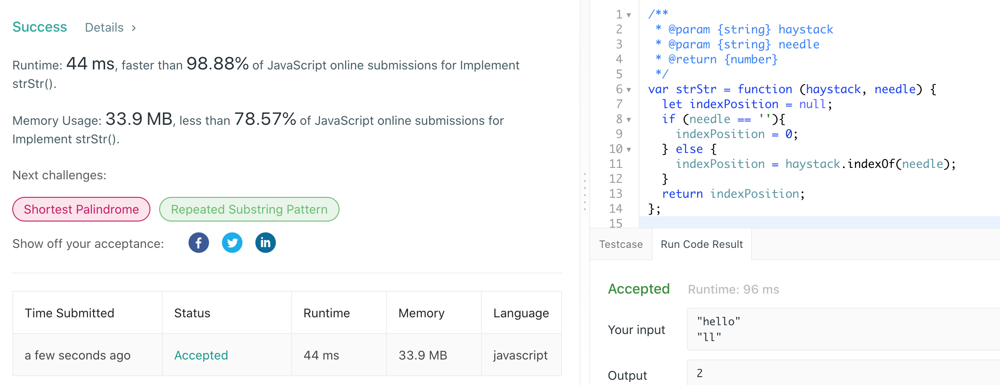

# Implement strStr()

Return the index of the first occurrence of needle in haystack, or **-1** if needle is not part of haystack.

**Example 1**:
```
Input: haystack = "hello", needle = "ll"
Output: 2
```

**Example 2**:
```
Input: haystack = "aaaaa", needle = "bba"
Output: -1
```

**Clarification**:

What should we return when *needle* is an empty string? This is a great question to ask during an interview.

For the purpose of this problem, we will return 0 when *needle* is an empty string. This is consistent to C's *strstr()* and Java's *indexOf()*.



